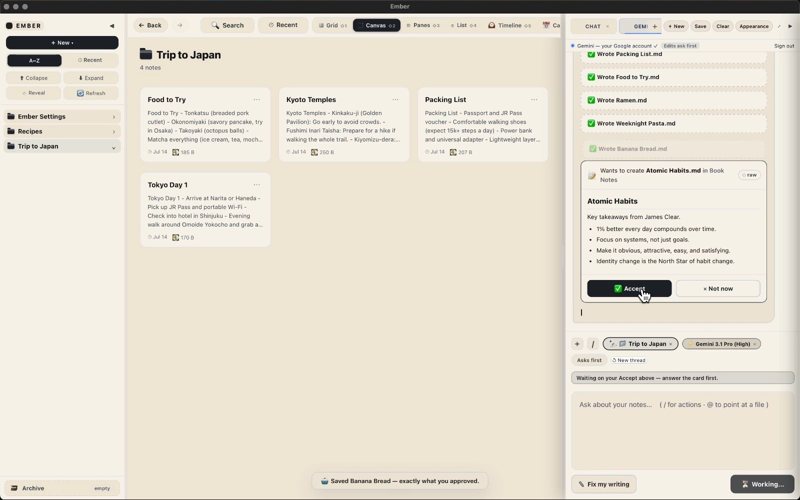
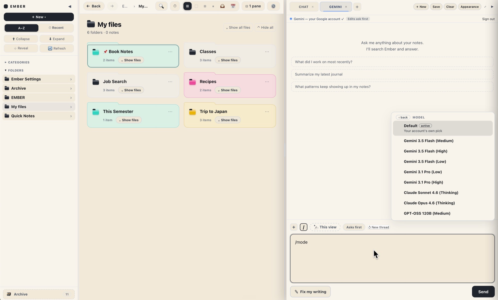
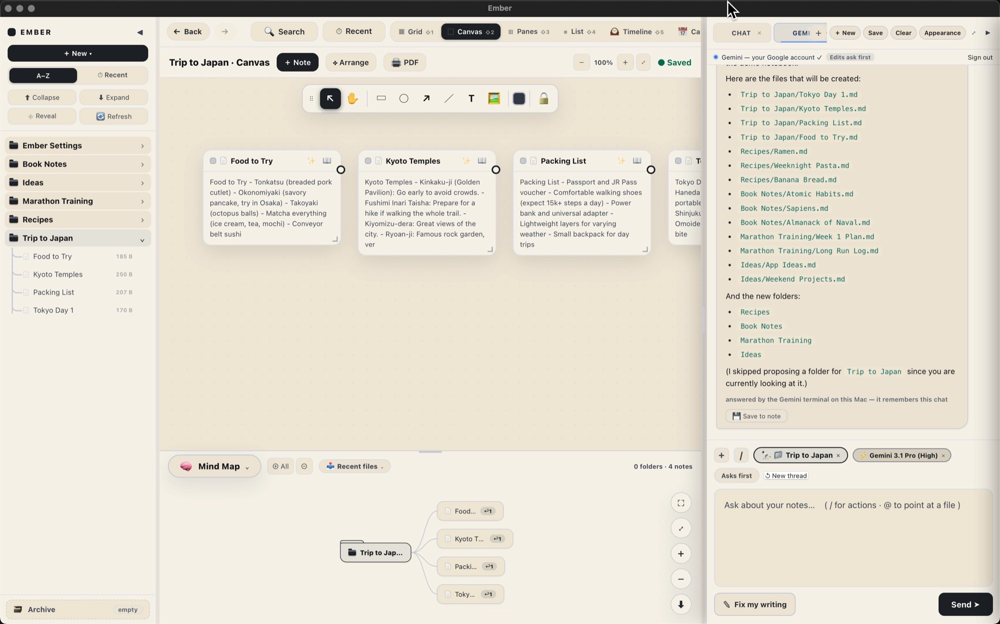
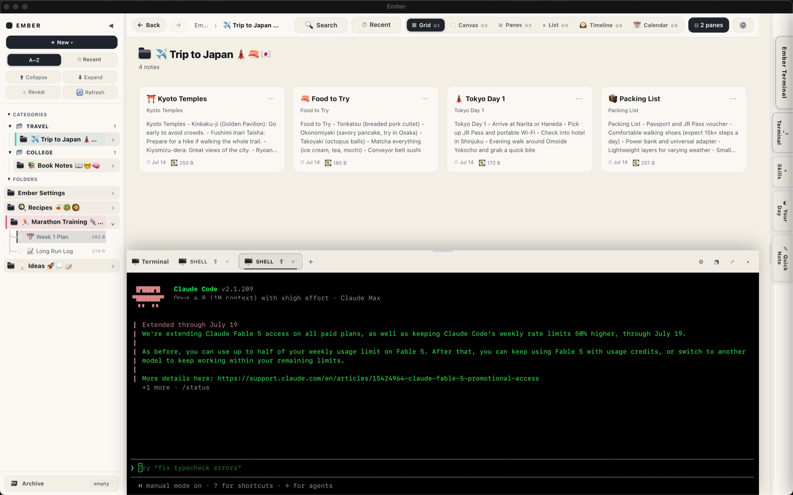
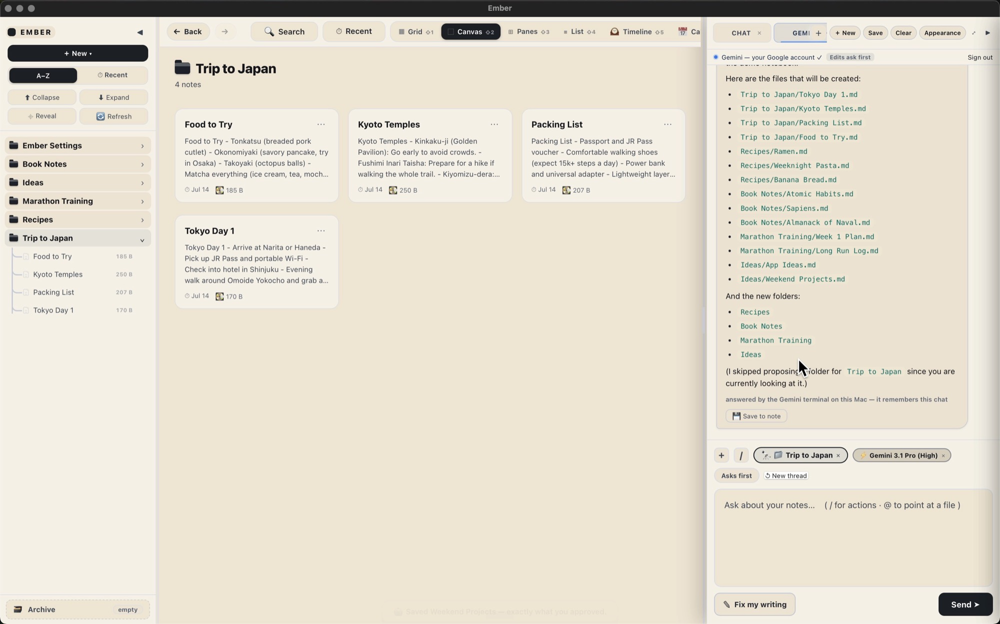
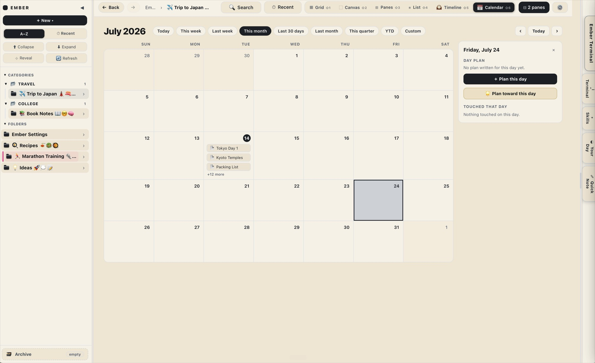

  

<h1 align="center">Ember</h1>

<b>A private AI notebook for your Mac. You write, Ember remembers.</b>

  <a href="https://embernotebook.github.io/ember/"><b>Website</b></a>
  &nbsp;&middot;&nbsp;
  <a href="https://github.com/MrNabeel/ember-notebook"><b>About the maker</b></a>

  

Ember is a notebook for your Mac with AI built in. Everything you tell it becomes a plain file on your Mac. Teach it something once and it remembers for good. Bring any AI you like, from Claude to one that runs offline.

## What makes Ember

- **Private.** Your notes are plain Markdown files on your own Mac. Lock a folder and the AI goes blind to it.
- **Local.** It runs on your machine. Point it at a local model and it keeps working with the Wi-Fi off.
- **Any AI.** Sign in with Claude, ChatGPT, or Google, or stay fully offline. The AI is a guest. The memory is yours.
- **Just files.** Everything Ember keeps is a plain file you can open, back up, or read ten years from now. You are never locked in.

## Bring your own AI

Ember does not sell you an AI. You bring the one you already have. Sign in with Claude, ChatGPT, or Google, or run a local model on your own Mac with no account at all. Switch whenever you want. You are not locked into one company's AI.

  

## A canvas and a mind map

See your notes the way your head actually works. Lay them out on an open canvas, connect them into a mind map, and let Ember arrange them for you. Ask it something and it writes the answer straight into real notes and folders on your Mac.

  

## A terminal, right inside

Ember has a real terminal built in, sitting next to your notes. Run real commands and AI agents without leaving the app or opening a second window. Terminal power, wrapped in a calm notebook.

  

## Drag and drop

Drag a note or a file from anywhere straight into the terminal, and its path types itself in. No copying long paths, no hunting through folders. Drop it and keep going.

## Teach it once

Show Ember how you like something done, the way you lay out a note or a routine you run every week, and it keeps it. You ask once, and it builds the notes and folders for you. You never explain it twice.

  

## Plan toward a day

Point Ember at a day, like an exam or a trip, and it spreads the work across the weeks between now and then. A little at a time, so nothing lands the night before.

  

## Download

### [Download Ember for Mac](https://github.com/embernotebook/ember/releases/latest/download/Ember.dmg)

Built for Apple Silicon Macs (M1 and later). Signed and notarized with Apple, so it opens like any other app.

## Website

[embernotebook.com](https://embernotebook.github.io/ember/)

## A note from the maker

I am building Ember on my own. If it earns a place on your Mac, a coffee keeps me going. No pressure at all, and thank you for trying it.

☕ [Buy me a coffee](https://buymeacoffee.com/m.nabeel)

## Created by

**Muhammad Nabeel**
[GitHub](https://github.com/MrNabeel) &middot; [LinkedIn](https://www.linkedin.com/in/mrnabeel1)

Built with Claude.
